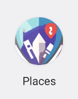
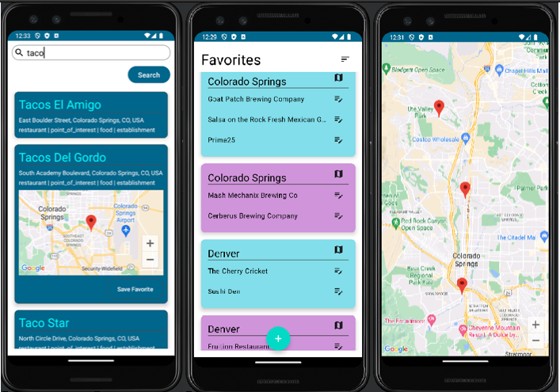
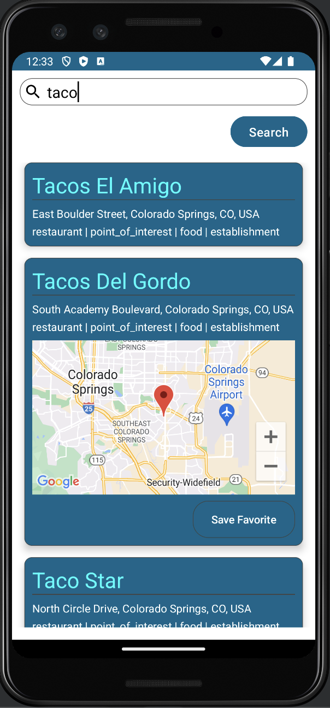
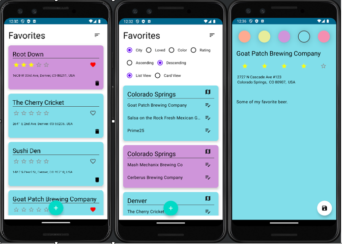
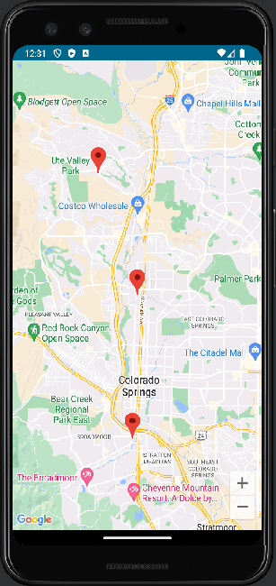
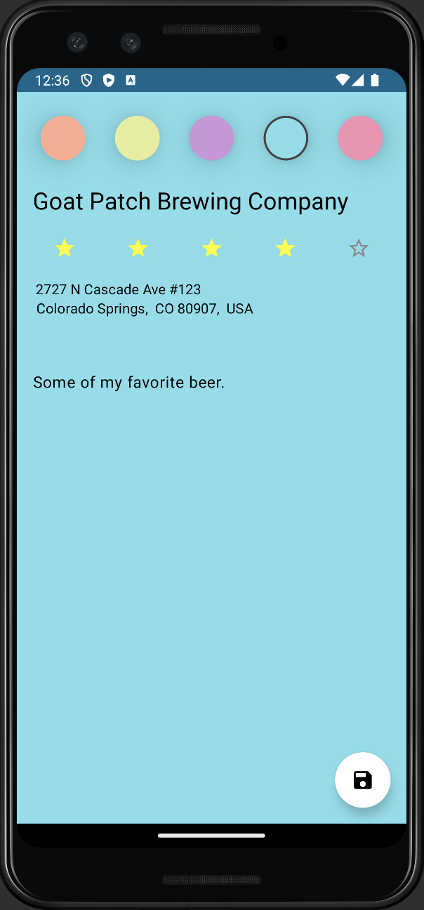

# PlacesApp
Android app uses Google places API and saves places as favorites. 

- **To Build and run the app**
    - clone repo to your computer.
    - you will need to install Android studio IDE to compile app. 
    - *Create Google API key*, go here: [Google Api Key](https://developers.google.com/maps/documentation/embed/get-api-key)
    - add your API key to local.properties file as MAPS_API_KEY="your_API_key"
    - Build project. 
    - install the apk file on your Android phone.

### All your favorite places in one easy to use app. 
no more text files of lists. instantly search and find google recommendations. easily access your favorite places and navigate right to them.  

Android app using Google Map API and Google places Api, to get place prediction from search and map data. 
Place predictions can be saved to an SQLite database.

Favorites can be displayed in card view and list view. Favorites can be ordered by city, card color, or loved status.

Users can explore a city's collective favorites by seamlessly accessing a map displaying all saved places within that city.

Each favorite place's card is a canvas for personalization. Users can rate, assign unique card colors, and add personal notes, ensuring memories are vividly captured.

